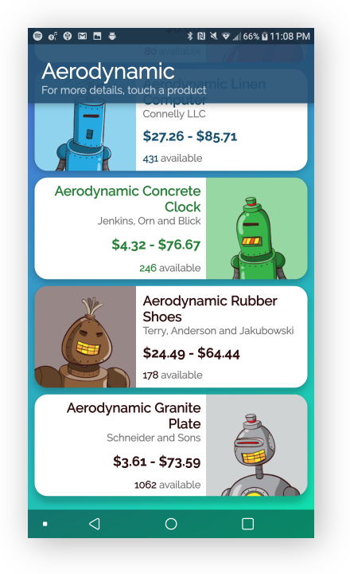

# Shopify 2019 Winter Job Application
This Android application was used to apply at Shopify for the 2019 Winter term. It is very similar concept wise to [this challenge](https://github.com/BenJeau/Shopify2018SummerChallenge) from 2018. It displays a list of products tags stored on an online JSON database. You can know more about the tags by taping them. In order to display efficiently every product, it is using a RecylcerView and for the tags, it is using a ChipGroup which contains multiple chips. In the products list, the main color of the product is extracted by creating a Palette. The application is mostly responsive, it depends on your network connection to access the database and the information about its products.

## Usage
If you only want to try the application, there is a [.apk](app.apk) file in which you can run or if you want to modify the code, the code is in this repository.

# Design
An interactive mockup of the application is available on Adobe XD, which can be accessed [here](https://xd.adobe.com/view/c19502b0-458a-40d2-5f77-d7207431b104-b7a4/). The mockup can also be seen below.

# Screenshots

